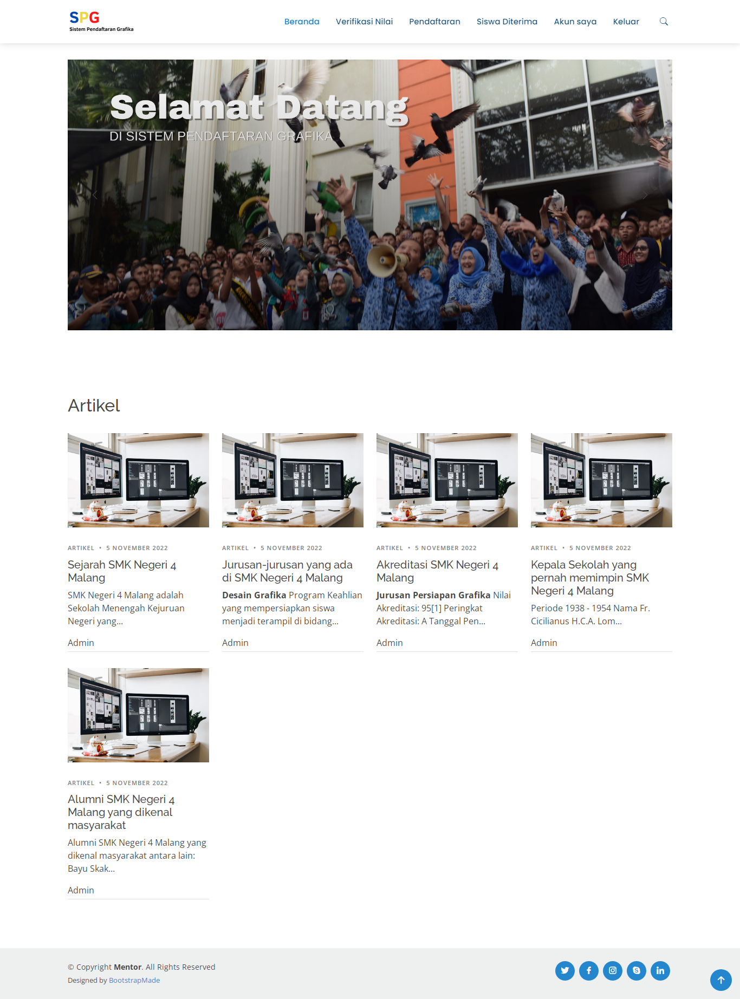

Sistem ini dibuat untuk memudahkan sekolah dalam melayani PPDB (Pendaftaran Peserta Didik Baru), yang mana sistem ini masih sangat sederhana.

Fitur yang ada pada sistem ini adalah:
  1. Melihat artikel
  2. Melakukan verifikasi nilai
  3. Melakukan pendaftaran
  4. Melihat data siswa diterima

Preview 
 
 
 
 

